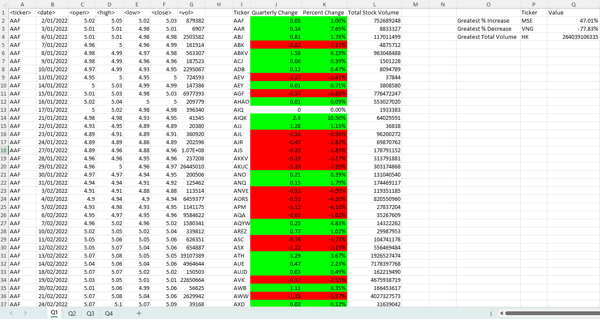
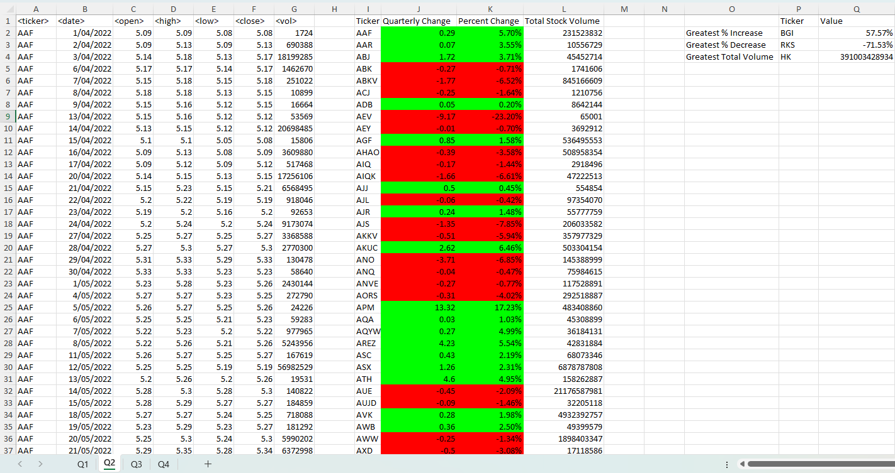
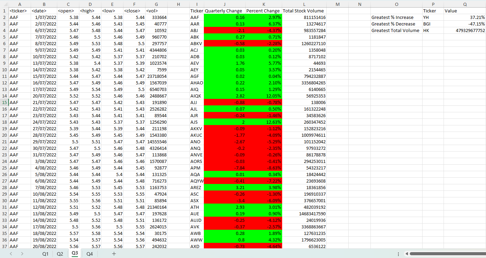
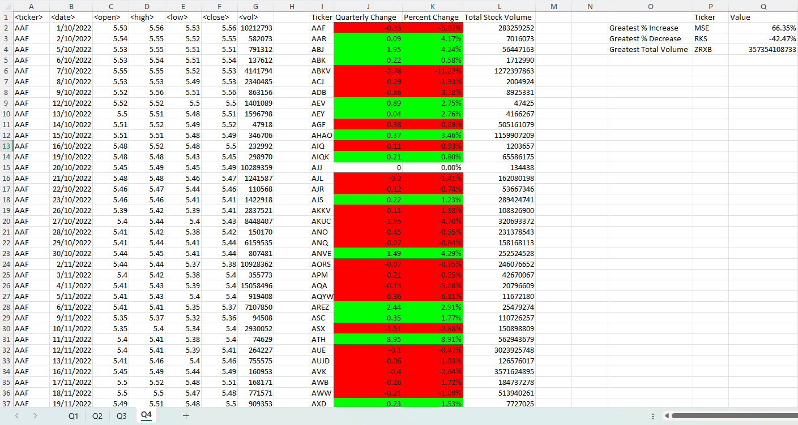

<h1 align = "center"> VBA Challenge </h1>

In this VBA project, I developed a script that processes stock data across multiple quarters. The script loops through each stock ticker symbol for every worksheet, which represents different quarters. For each stock, it calculates and outputs essential financial metrics, including the quarterly change in price, percentage change, and total volume traded. Additionally, the script identifies and returns the stock with the greatest percentage increase, the greatest percentage decrease, and the greatest total volume for each quarter. This comprehensive analysis provides valuable insights into stock performance over time. By automating these calculations, the script enhances efficiency and accuracy, making it an indispensable tool for financial analysis and decision-making.

## Table of Contents

- [Criteria](#criteria)
- [Data](#data)
- [Results](#results)
- [References](#references)
- [License](#license)

## Criteria

```
Create a script that loops through all the stocks for each quarter and outputs the following information:

- The ticker symbol
- Quarterly change from the opening price at the beginning of a given quarter to the closing price at the end of that quarter.
- The percentage change from the opening price at the beginning of a given quarter to the closing price at the end of that quarter.
- The total stock volume of the stock.
- Add functionality to your script to return the stock with the "Greatest % increase", "Greatest % decrease", and "Greatest total volume".
- Make the appropriate adjustments to your VBA script to enable it to run on every worksheet (that is, every quarter) at once.
```

## Data

The dataset utilised in this project is a comprehensive record of stock market transactions for the year 2022, provided by edX Boot Camps LLC strictly for educational purposes. It is structured into an Excel workbook titled `Multiple_year_stock_data.xlsx`, with each worksheet corresponding to a quarter's trading data for a variety of stocks. The data includes detailed information on stock performance and trading volume, offering insights into the market activities throughout the four quarters of the year 2022. Below is an outline of the data columns present in each worksheet:

| Column | Description |
| ------ | --------------------------- | 
| Ticker | The unique stock identifier |
| Date | The trading date |
| Open | The price fo the stock at the market open |
| High | The highest price of the stock during the day |
| Low | The lowest price of the stock during the day |
| Close | The price of the stock at the market close |
| Volume | The number of shares traded during the day |


## Results

<u><b>Quarterly 1:</b></u>



1. Greatest % Increase: The ticker with the greatest percentage increase in Q1 is MSE with a 47.01% increase. This indicates a significant positive market reaction or company performance during this period.

2. Greatest % Decrease: The ticker with the greatest percentage decrease in Q1 is VNG with a 77.83% decrease. This reflects a substantial negative impact on the stock, possibly due to poor earnings, bad news, or market conditions.

3. Greatest Total Volume: The stock with the greatest total volume in Q1 is HK with a total volume of 264039106335. This high trading volume suggests that HK was heavily traded, indicating strong investor interest or high liquidity during the quarter.

<br>

<u><b>Quarterly 2:</b></u>



1. Greatest % Increase: The stock with the greatest percentage increase in Q2 is BGI with a 57.57% increase. This highlights a notable positive trend in the stock's performance, potentially due to favorable market conditions or strong company results.

2. Greatest % Decrease: The stock with the greatest percentage decrease in Q2 is RKS with a 71.53% decrease. This significant drop might be attributed to adverse news, poor financial performance, or broader market downturns.

3. Greatest Total Volume: The stock with the greatest total volume in Q2 remains HK with a total volume of 391003428934. This continued high trading volume shows sustained investor interest or significant activity in the stock.

<br>

<u><b>Quarterly 3:</b></u>



1. Greatest % Increase: The ticker with the greatest percentage increase in Q3 is YH with a 37.21% increase. This indicates strong positive performance and possible favorable events or market sentiment for this stock.

2. Greatest % Decrease: The ticker with the greatest percentage decrease in Q3 is BGI with a 47.15% decrease. This sharp decline suggests that the stock faced negative conditions, possibly reversing the previous quarter's gains.

3. Greatest Total Volume: The stock with the greatest total volume in Q3 is HK with a volume of 479329677752. This consistently high volume suggests ongoing high liquidity and investor interest in the stock.

<br>

<u><b>Quarterly 4:</b></u>



1. Greatest % Increase: The ticker with the greatest percentage increase in Q4 is MSE with a 66.35% increase. This substantial increase could be due to positive developments or strong financial performance in the final quarter of the year.

2. Greatest % Decrease: The ticker with the greatest percentage decrease in Q4 is RKS with a 42.47% decrease. This significant drop highlights possible negative factors affecting the stock towards the year-end.

3. Greatest Total Volume: The stock with the greatest total volume in Q4 is ZRXB with a total volume of 357354108733. This high trading volume indicates significant investor activity or interest during the quarter.

<br>

## References

Data for this dataset was generated by edX Boot Camps LLC, and is intended for educational purposes only.

## License

This project is licensed under the [MIT License](https://github.com/Yukitoshi12345/VBA-Challenge/blob/main/LICENSE).
